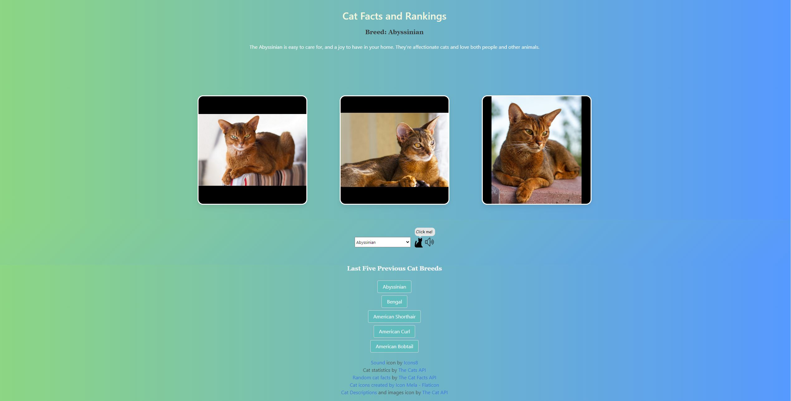

# Cat Images and Facts Retriever

## Description

Our motivation for building this project was to practice working to create an application as part of a team.  Our original vision for this project was to have an application that calls APIs to retrieve facts about animals and images of animals.  However, we were having trouble finding APIs to use, so we decided to switch to cat breeds instead.  We built this project to practice calling APIs and to practice working in a team, to better simulate what real software development would be like.  This project solves the problem of a user needing to find out about various cat breeds in order to choose a type he or she wishes to adopt.  In this project, we acquired experience with calling APIs, and we learned how to collaborate to create an application and how to resolve GitHub merge conflicts.  We also learned how to look for APIs to solve a particular problem and how to change our plans if the original plans weren't working well.

## Technologies Used

This application uses HTML, CSS and JavaScript to create a functioning webpage that changes when the user interacts with various elements.  

For this application, we called [The Cat API](https://thecatapi.com/) to retrieve cat images, the [Cats API](https://api-ninjas.com/api/cats) to retrieve the facts and statistics for specific breeds of cats, and the [Cat Facts API](https://cat-fact.herokuapp.com/#/) to retrieve the random overall cat fact that is displayed on the back of the third card when a breed is chosen.  Please feel free to view the APIs by clicking on their respective links.

## Team Involvement and Breakdown of Tasks

Gabriel - JavaScript functionality for APIs and selectors, Assets, Research

Villy - CSS, Bulma, JavaScript functionality for API, Local Storage, Research

Zack - CSS, Bulma, Sound functionality, Research, Assets, and Support

Dusty - Team lead, CSS, Bulma, Research, Assets, and Support

## Table of Contents (Optional)

This README isn't that long, so N/A.

## Installation

N/A

## Usage

To use the application, please go to the following link: [https://KaarageOnigiri.github.io/Cat-Images-and-Facts-Retriever](https://KaarageOnigiri.github.io/Cat-Images-and-Facts-Retriever).  

To start, choose a breed of cat from the dropdown window.  Then, click the cat icon next to the dropdown window.  The application will display up to three images of your chosen cat breed.  Clicking on an image will flip that card over.  You can click on the card on the left to display facts about the chosen cat breed.  Clicking on the card in the middle will display cat statistics, such as playfulness and amount of required grooming, ranging from very low to very high.  Clicking on the card on the right will display a random cat fact.  The application will also store and display up to five of your previously chosen cat breeds, and this data will persist when closing and reopening the application.  Clicking on one of those breeds will pull up its information and images again.  If an API call fails, the application will inform the user of this via a modal dialog box.

Here is a screenshot of the application: 

## Credits

To build this project, I, [Gabriel Morrow](https://github.com/theboss1485), worked with [Dustin Gray](https://github.com/RickiBobbii), [Villy Yeoh](https://github.com/KaarageOnigiri), and [Zack Burnell](https://github.com/ZBurnell).  Please feel free to visit our GitHub profiles by clicking on our names.

I used the official Bulma documentation to create a modal dialog box for the purpose of displaying errors.  I copied code from there and made changes as necessary: [https://bulma.io/documentation/components/modal/](https://bulma.io/documentation/components/modal/)

I copied the list of breed descriptions from The Cat API: [https://api.thecatapi.com/v1/breeds](https://api.thecatapi.com/v1/breeds)

We downloaded the kitten meow sound from [https://quicksounds.com/library/sounds/cat](https://quicksounds.com/library/sounds/cat).

We downloaded the cat icon from [https://www.flaticon.com/free-icons/cat](https://www.flaticon.com/free-icons/cat).

We downloaded the sound icon from [https://icons8.com/icons/set/sound](https://icons8.com/icons/set/sound).

We downloaded the cat banner image from [https://unsplash.com/s/photos/cat](https://unsplash.com/s/photos/cat)

We followed a tutorial to create a CSS linear gradient at [https://codepen.io/brucebrotherton/pen/wvqjORe](https://codepen.io/brucebrotherton/pen/wvqjORe)

I used the Xpert Learning Assistant AI chatbot to help out with writing the code.

## License

This project is under an MIT license.  Please see the license in the GitHub repository for more information.

## Badges

We don't have any badges to display.

## Features

This project is an application that displays images, facts, and rankings of various cat breeds.  The user chooses which breeds he or she wishes to view.  The application also stores the user's most recent searches and displays one if the user clicks the button corresponding to that breed.  The application also displays some random cat facts.

## How to Contribute

This was an assignment that we completed for a software development bootcamp, so N/A.

## Tests

N/A
